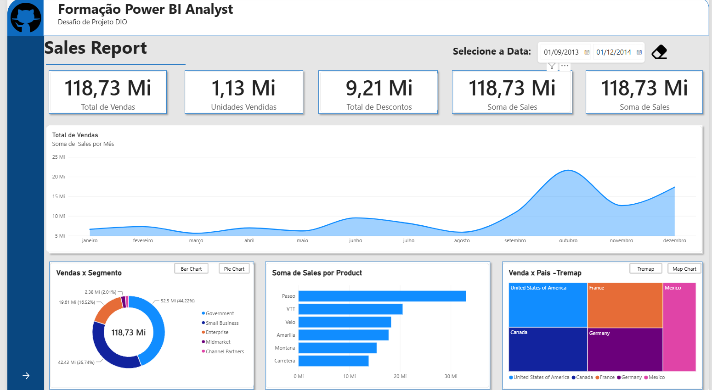
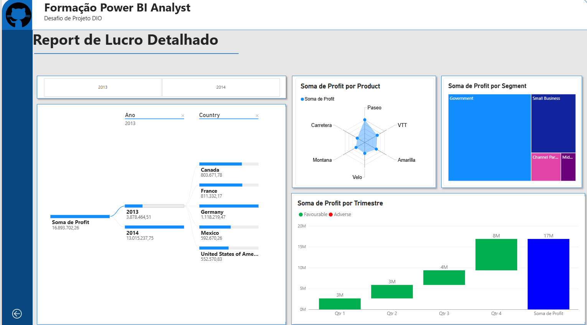

# 📊 Power BI Analyst — Dashboard Financeiro


## 📌 Sobre o Projeto

Projeto desenvolvido como parte do desafio da **Formação Power BI Analyst da DIO**, com o objetivo de construir um relatório financeiro interativo utilizando a base de dados **Financials Sample**, explorando recursos de visualização, segmentação, navegação e análise de indicadores.

O projeto foi desenvolvido buscando não apenas reproduzir o modelo apresentado durante a formação, mas também organizar o relatório de forma visual, intuitiva e funcional, permitindo uma análise mais clara dos dados de vendas e lucratividade.

---

## 🎯 Objetivo

Desenvolver um dashboard financeiro capaz de apresentar informações relevantes sobre:

- 💰 Vendas totais
- 📦 Unidades vendidas
- 🏷️ Descontos
- 📈 Evolução das vendas ao longo do tempo
- 🌎 Vendas por país
- 👥 Vendas por segmento
- 🚲 Vendas por produto
- 💵 Lucro por produto
- 👥 Lucro por segmento
- 📅 Lucro por trimestre
- 📊 Análise detalhada por período e país

Além disso, o relatório deveria utilizar recursos de interação e navegação disponíveis no Power BI.

---

## 🖥️ Estrutura do Dashboard

O relatório foi dividido em **duas páginas principais**.

### 📈 Página 1 — Sales Report

A primeira página apresenta uma visão geral das vendas, permitindo acompanhar os principais indicadores comerciais.

#### Principais elementos:

- **Total de Vendas**
- **Unidades Vendidas**
- **Total de Descontos**
- **Soma de Sales**
- Gráfico de evolução das vendas por mês
- Análise de vendas por segmento
- Análise de vendas por produto
- Análise de vendas por país

Também foram utilizados:

- Segmentador de período;
- Botões de navegação;
- Alternância entre diferentes tipos de visualização;
- Elementos interativos para facilitar a exploração dos dados.

### 💰 Página 2 — Report de Lucro Detalhado

A segunda página foi criada para aprofundar a análise de lucratividade.

#### Principais elementos:

- Análise de lucro por ano;
- Análise por país;
- Lucro por produto;
- Lucro por segmento;
- Lucro por trimestre;
- Visualização da evolução do resultado ao longo dos períodos.

Entre os recursos utilizados estão:

- Segmentação por ano;
- Segmentação por país;
- Gráfico de radar para análise de lucro por produto;
- Treemap para análise de lucro por segmento;
- Gráfico de colunas para análise trimestral;
- Indicadores de resultado.

---

## 📊 Visualizações

### Sales Report



A primeira página concentra os principais indicadores de vendas e permite uma visão geral do desempenho comercial.

---

### Report de Lucro Detalhado



A segunda página aprofunda a análise financeira, permitindo identificar como o lucro está distribuído entre produtos, segmentos, países e períodos.

---

## 🛠️ Tecnologias e Recursos Utilizados

- **Microsoft Power BI**
- Power Query
- DAX
- Modelagem de dados
- Segmentadores de dados
- Indicadores (Cards)
- Gráficos interativos
- Gráfico de área
- Gráfico de barras
- Gráfico de rosca
- Treemap
- Gráfico de radar
- Botões de navegação
- Interação entre visuais
- Filtros por período
- Filtros por país

---

## 🧠 Conceitos Aplicados

Durante o desenvolvimento foram aplicados conceitos relacionados a:

### 📐 Modelagem e preparação de dados

- Importação da base Financials Sample;
- Tratamento e organização dos dados;
- Criação e utilização de relacionamentos;
- Preparação dos dados para análise.

### 📊 Visualização de dados

Construção de diferentes tipos de gráficos para representar:

- Tendências;
- Comparações;
- Distribuição;
- Participação;
- Evolução temporal;
- Indicadores financeiros.

### 🔎 Interatividade

O dashboard utiliza recursos interativos para permitir que o usuário explore os dados de acordo com diferentes filtros e perspectivas.

### 🧭 Navegação

Foram implementados botões de navegação entre as páginas do relatório, proporcionando uma experiência mais próxima de um aplicativo analítico.

---

## 📁 Estrutura do Repositório

```text
📦 power-bi-analyst
│
├── 📊 Dashboard1.png
├── 📊 Dashboard2.png
├── 📄 README.md
└── 📊 [arquivo do Power BI]
